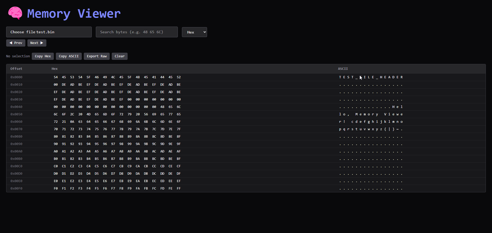

# 🧠 memory-viewer

A browser-based tool for exploring binary files.
It shows both hex and ASCII views, lets you search through memory, and makes it easy to select, copy, or export bytes. The heavy lifting is done in Rust, compiled to WebAssembly, with a React frontend for the interface.

---

## Why I Built This

I’ve always found hex editors fascinating, but most of the ones I’ve used are desktop-only and feel a bit dated. I wanted to see if I could bring that experience into the browser using **Rust → WASM** for performance and React for the UI.

This project gave me practice with:

* Compiling Rust to WebAssembly and exposing APIs to JavaScript
* Managing byte-level data efficiently in the browser
* Building a responsive interface for a pretty niche use case

---

## Features

* Hex + ASCII side-by-side views
* Search by ASCII or hex values
* Keyboard navigation and shift-selection
* Click and drag to select byte ranges
* Copy selections as hex or ASCII
* Export selections as `.bin` files
* Responsive dark UI styled with Tailwind

---

## Screenshot

<p align="center">  
    
</p>  

---

## Getting Started

### Build the Rust core (to WASM)

```bash
cd core
wasm-pack build --target web
```

### Run the React frontend

```bash
cd ../frontend
npm install
npm run dev
```

> The frontend expects the WASM build, so build the core first.

---

## Usage

1. Open the app in your browser
2. Drop in any `.bin`, `.rom`, `.img`, or similar file
3. Navigate with keyboard or mouse
4. Search, copy, or export regions as needed

---

## What I Learned

* Bridging Rust and JavaScript with WASM
* Handling low-level data structures in a web environment
* Designing UIs for technical/debugging tools
* Thinking about performance in terms of both Rust code and frontend rendering

---

## License

MIT © 2025 tommantonclery
